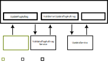

# Kafka Referenzarchitektur Flughafen München Prototyp

In diesem Prorotyp wird eine einfache Microservicearchitektur nach dem Prinzip Command Query Responsibility Segregation (CQRS) zum verändern und auslesen von Flugdaten realisiert. Vorrausgesetzt wird ein Kafka und ksqlDB Cluster in der Confluent Cloud.

Das dependencymanagement wird mit Maven erledigt. Als zum Schematisieren der Nachrichten wird AVRO mit dem 'avro-maven-plugin' von 'org.apache.avro' verwendet  

Die Architektur zum Verändern von Flugdaten ist in der folgenden Graphik veranschaulicht.

Ein Event im Topic Fluege stellt einen einzelnen Flug dar.
Ein Flug besteht aus:
- KNR -> Eindeutige Kennung des Fluges
- KKN -> Eindeutige Kennung eines Flugzeugs
- LSK -> Flag das anzeigt, ob Flieger landet (L) oder Startet (S)
- SAA -> Status des Fluges
- STT -> Startzeit am Gate
- FLA -> Servicetyp eines Fluges

Mit ksqlDB wird auf diser Grundlage ein Tabelle erstellt, die zu jedem Flieger den Hin- und Rückflug enthält.

## Benötigte Topics
- Fluege (angelegt als compacted Topic)
- UpdateFlugAuftrag
- ValidierterUpdateFlugAuftrag

## Beschreibung der einzelnen Services
Services zum Verändern von Daten
- ProduceFlightEvents
- FlightUpdateEvents
- ValidateFlugAuftrag
- UpdateFlight
Service zum Auslesen von Daten
- CompleteFlight

### ProduceFlightEvents
Erzeugt Flüge und publiziert sie auf das Topic Fluege.

### FlightUpdateEvents
Simuliert den Adapter aus der Graphik und versendet Aufträge Flüge zu verändern auf das Topic UpdateFlugAuftrag.

### ValidateFlugAuftrag
Validiert die Flugauftrage. Publizeirt die validierten Aufträge auf das Topic ValidierterUpdateFlugAuftrag.

### UpdateFlight
Joined einen Flug vom Fluege Topic mit dem Auftrag des ValidierterUpdateFlugAuftrag und publiziert das entstehende Event auf das Topic Fluege.

### CompleteFlight
Liest aus einer Tabelle die einem Flugzeug den Hin- und-Rückflug enthält, einen Flug mit der gesuchten KNR und gibt die STT der beiden Flüge aus.

## Anleitung
1. Topics anlgen
2. ksqlDB Befehle ausführen
3. API-Keys für Schema-Registry Kafka-Cluster und ksqlDB vergeben und in properties.txt sowie CompleteFlight einfügen
4. mit ProduceFlightEvents Flüge erzeugen
5. mit FlightUpdateEvents UpdateAufträge generieren
6. ValidateFlugAuftrag Aufträge validieren lassen
7. UpdateFlight die Aufträge mit den aktuellen Daten vereinigen lassen
8. mit ksqlDB eine KKN raussuchen, die existiert und mit CompleteFlight abfragen
